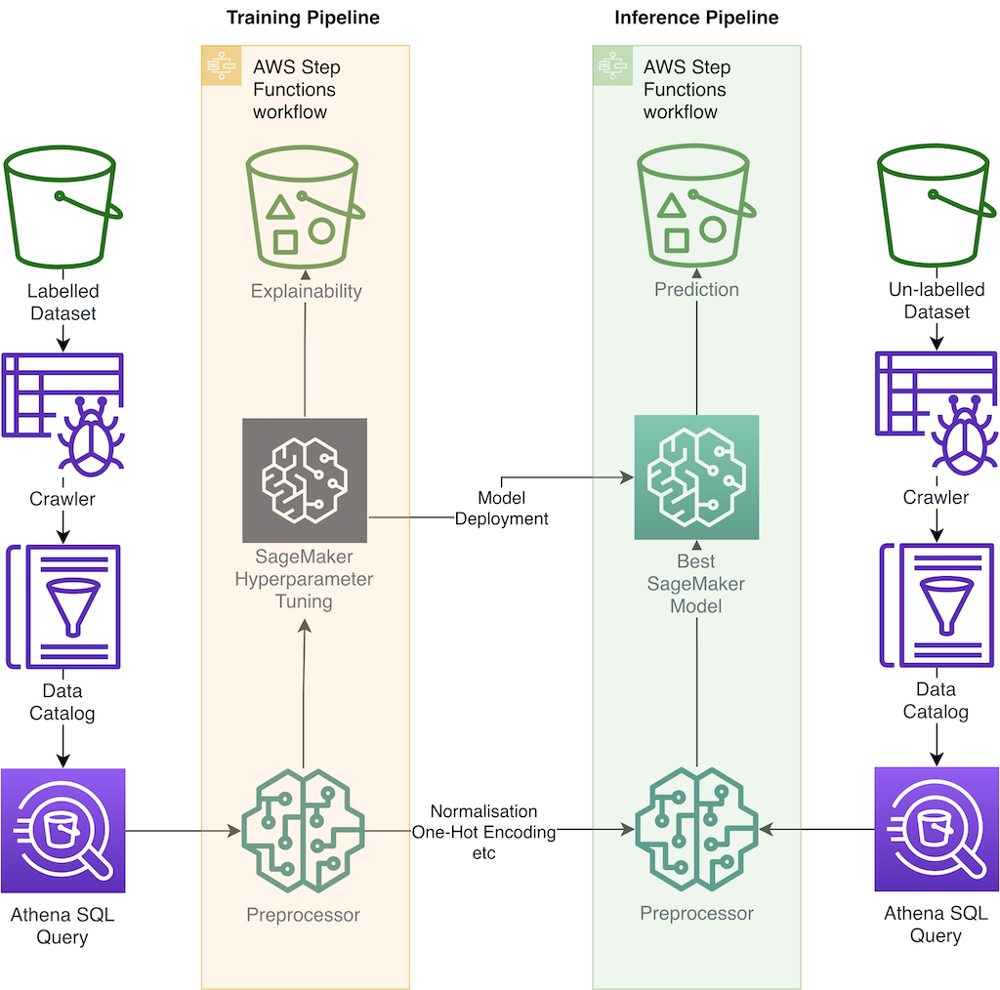
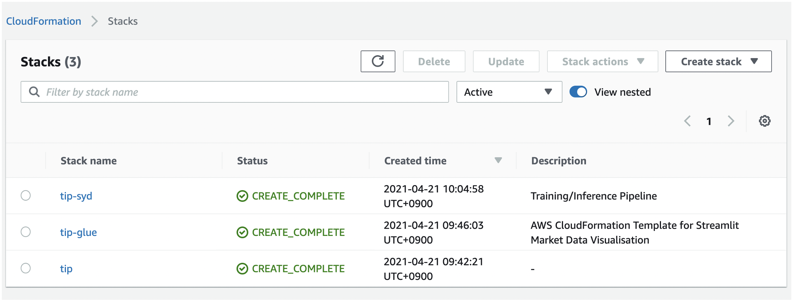
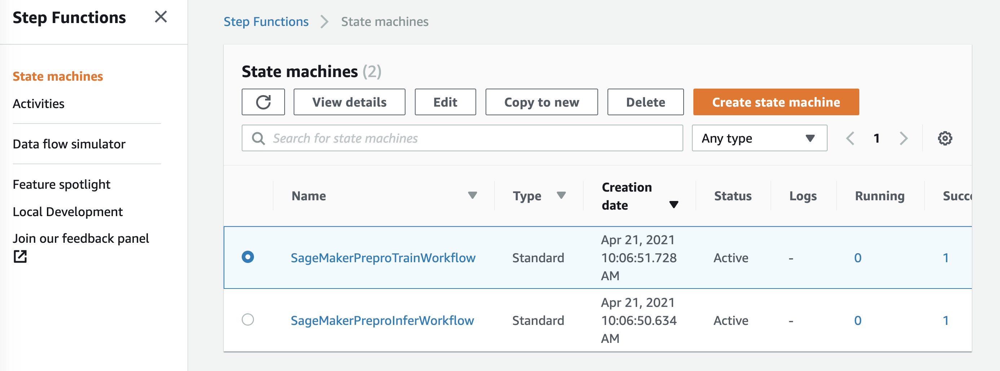
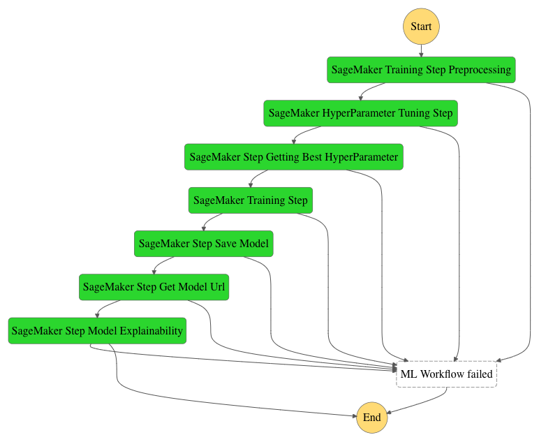
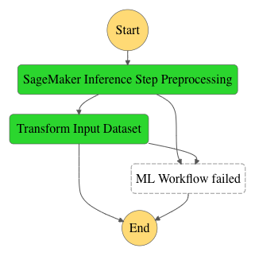

# Customer Churn on AWS

_A python package for deploying an end to end customer churn prediction pipeline on AWS_

## Alpha Notice

Right now this is an Alpha and should not be used for production.

## Tutorial

[notebook](notebook/Sample_Churn_Data_ETL.ipynb)

## Getting Started

    # Set up the resources
    ./stand_up.sh

    AWS_REGION=$(aws configure get region)

    # Trigger the training pipeline
    aws lambda --region ${AWS_REGION} invoke --function-name invokeTrainingStepFunction --payload '{ "": ""}' out

    # Trigger the inference pipeline
    aws lambda --region ${AWS_REGION} invoke --function-name invokeInferStepFunction --payload '{ "": ""}' out

    # Clean up
    ./delete_resources.sh

# Deploying a Scalable End to End Customer Churn Prediction Solution with AWS

Losing customers costs money. Discovering customers likely to leave, and then stopping them from churning, saves money. Wouldn’t it be great if you could hold onto customers longer, maximizing their lifetime revenue? Wouldn’t it be even better if this could be done with machine learning scaleably?

Well, guess what - you can!


In this blog post, you will deploy an End to End Customer Churn Prediction solution using AWS services. You will build automated training and inference pipelines with [Amazon SageMaker](https://aws.amazon.com/sagemaker/) and [AWS Step Functions](https://aws.amazon.com/step-functions/?step-functions.sort-by=item.additionalFields.postDateTime&step-functions.sort-order=desc) for Machine Learning churn detection. Aside from identifying customers that are most likely to churn, on demand capabilities, run as ETL procedures, support preprocessing, and have explainability all baked in. Templated with infrastructure as code, you can then reapply and scale this solution to different datasets. The churn prediction solution serves as a reference implementation, that makes it easier for organisations of all sizes to implement an end-to-end training and inference pipeline.

This solution supports data ingestion, training/retraining, and inference by using [Amazon Lambda](https://aws.amazon.com/lambda/) calls to trigger pipeline runs. It makes use of Amazon [S3](https://aws.amazon.com/s3/) integrated directly with Amazon SageMaker and AWS Step Functions backed by, [Amazon Glue](https://aws.amazon.com/glue/?nc2=type_a&whats-new-cards.sort-by=item.additionalFields.postDateTime&whats-new-cards.sort-order=desc) and [Amazon Athena](https://aws.amazon.com/athena/?nc2=type_a&whats-new-cards.sort-by=item.additionalFields.postDateTime&whats-new-cards.sort-order=desc). This allows for the ability to automate runs, experiment rapidly, deploy quickly and easily incorporate expanding data sizes at the Tera-byte level.

## Solution Overview

The following architectural diagram illustrates the workflow of the solution:



The workflow includes the following steps:

1. An S3 bucket that serves to house data, cloud formation templates, and model artefacts
2. An [Amazon Glue Crawler](https://docs.aws.amazon.com/glue/latest/dg/add-crawler.html) which scans the data from S3 and loads it into the Athena database.
3. An Amazon Athena database pointing to the training and inference data in S3.
4. A training pipeline step function workflow (state space machine) which consists of Amazon Lambda triggers that run Amazon SageMaker Preprocessing and Amazon SageMaker training jobs
5. An inference pipeline step function workflow (state space machine) which consists of Amazon Lambda triggers that run Amazon SageMaker Preprocessing and Amazon SageMaker inference jobs

## Before Getting Started

Before you get started, you will first need an AWS account setup with credentials configured, as explained in this [documentation](https://docs.aws.amazon.com/sdk-for-java/v1/developer-guide/setup-credentials.html). In addition, make sure the [AWS Command Line Interface](https://aws.amazon.com/cli/) AWS CLI is already installed. This tutorial assumes that you have an environment with the necessary [Identity Access Management IAM permissions](https://docs.aws.amazon.com/IAM/latest/UserGuide/getting-started.html).

## A Quick Glimpse at the Data

In this example, you will use a synthetic churn dataset for an imaginary telecommunications company with the outcome `Churn?` flagged as as either `True` (churned) or `False` (did not churn). Features include customer details such as plan and usage information. The churn dataset is publicly available and mentioned in the book [Discovering Knowledge in Data](https://www.amazon.com/dp/0470908742/)) by Daniel T. Larose. It is attributed by the author to the University of California Irvine Repository of Machine Learning Datasets.
 Keep in mind, that this dataset is replaceable with your own so long as the codebase updated to accommodate it.
In other words, if your goal is to reapply this to your data, this post is the first step to getting you there! Read on and you will see how.

## Launch the Solution

First clone the Github repo into a local folder.

`git clone https://github.com/aws-labs/customer-churn-sagemaker-pipeline.git`

In the cloned directory there should be a file called `standup.sh`. We will next use this script to build out the necessary infrastructure to run both the training and inference pipelines. The script only takes three commands: the name you want to give the stack and its associated resources, the stack’s region, and the AWS Bucket name to house all artefacts and data. You can run the command like the following:

`bash standup.sh {STACK_NAME} {S3_BUCKET_NAME} {REGION}`

`bash standup.sh churn-pipeline churn-pipeline-artifacts ap-southeast-2`

This will then start standing-up the necessary resources in your default AWS account using calls to the AWS CLI and deploying [Amazon CloudFormation](https://aws.amazon.com/cloudformation/) templates.

Specifically, this script will create:

1. An Amazon Athena database complete with the primary workgroup name based on the stack name
2. An Amazon Glue Crawler, along with an IAM role for the Crawler, to scan data and load it into the database from the designated S3 bucket
3. Upload the training, inference and preprocessing python scripts into your S3 bucket
4. Upload the AWS Step Functions `pipeline.yaml` into your S3 bucket
5. Deploy the AWS Step Functions pipelines for training and inference. This is done based on the above S3 location and creates multiple Amazon Lambda and Amazon SageMaker jobs.
6. Writes the stack name and region to `delete_resources.sh`, so that this script can later be used to tear down the AWS infrastructure

Once the the standup completes, your CloudFormation console should look like the below, with all stacks showing green.



Likewise, if you go to Athena console, you will now see tables for both training and inference.


Note that the name of the database will be based off the S3 Bucket name you assigned in `standup.sh`.

Finally, if you go to the Step Functions menu, you will now see two State Machines (or workflows) - one for training and the other inference.



Before diving deep into the steps for these workflows provide and their Continuous Delivery aspects, let’s quickly review the Continuous Integration setup for the source repository and how it ameliorates this solution further.

## The Automated Training Pipeline

Both pipelines are designed to run as needed or scheduled, with the ability to automate the deployment of packaged code so that there is little effort and risk in deployment. This section and the next will explain how each pipeline works, brining you one step closer to a fully automated machine learning churn pipeline.

The training pipeline uses Amazon Lambdas with Amazon SageMaker to output a fully trained, validated and optimized churn model to Amazon S3 in seven steps.



Let’s first kick off the training pipeline by invoking Amazon Lambda:

```bash
aws lambda --region ${REGION} invoke --function-name invokeTrainingStepFunction --payload "{ '': ''}" out
```

You should get back the 200 code indicating that the Lambda triggered

```json
{
  "StatusCode": 200,
  "ExecutedVersion": "$LATEST"
}
```

Now, the job is kicking off! Let’s review the steps it is taking.

### Step 1: SageMaker Training Step Pre-processing

An Amazon SageMaker preprocessing job is run on data queried directly from the Amazon Athena table making use of [SageMaker’s Scikit Learn container.](https://github.com/aws/sagemaker-scikit-learn-container)

This step is run using `scripts/preporcessing.py` in the following order:

1. Data is read from the Athena table using [awswrangler](https://github.com/awslabs/aws-data-wrangler)
2. Data is split into training and validation datasets via a randomized split
3. Missing values are imputed and categorical values are one hot-encoded
4. The split and preprocessed datasets are then written back to S3 as csv files
5. The preprocessor is saved for use in the inference pipeline

The preprocessing scripts and Cloud Formation template `pipeline.yaml`’s Step Functions arguments are update-able.
For example, the entry point arguments for the container are set in the CloudFormation as:

```
"ContainerArguments": [
      "--database",
      "${AthenaDatabaseName}",
      "--region",
      "${AWS::Region}",
      "--table",
      "train",
      "--train-test-split-ratio",
      "0.2"],
```

The database name `{AthendaDatabaseName}` is passed in as the name of your stack with `-db` attached. Region is set from the variable you passed to `standup.sh`. The table name defaults to the training data name, in this case, “train”. Lastly, the random split between train and test is set here as a default, with 20% the data held out for testing.

For this blog post, you will leave `pipeline.yaml`’s settings as is. Keep in mind, it’s possible to change all of these configurations based on your data.

### Step 2 : SageMaker HyperParameter Tuning Step

The Hyperparameter tuning step finds an optimal combination of hyperparmaters for your model. In this example, you use [XGBoost](https://en.wikipedia.org/wiki/XGBoost)to model churn as a binary outcome (will churn / will not churn). Specifically, you are going to try to achieve the highest accuracy possible through maximizing the [Area Under the Curve](https://en.wikipedia.org/wiki/Receiver_operating_characteristic), finding the best regularization terms, depth and tree splitting combinations in repeated parallel runs (defaulted at 2 total). This produces the most accurate model given the available data.

It’s worth noting that there is no script here. All configurations are passed as JSON directly to SageMaker in `pipeline.yaml`, using [SageMaker’s XGBoost container](https://github.com/aws/sagemaker-xgboost-container). As before, defaults are hardcoded. However, like all parts of the pipeline, these are updatable as needed. For a deeper look on HyperParameter Tuning with Amazon SageMaker and the the type of inputs possible see [here](https://docs.aws.amazon.com/sagemaker/latest/dg/automatic-model-tuning.html).

### Step 3: SageMaker Step Getting Best Hyperparameter

This step calls a Lambda function to record the best performing model (and hyperparameter configurations) and then passes it on to the next step in the Step Functions workflow.

### Step 4: SageMaker Training Step

Now with the best model identified, you will re-train one more time to obtain the fully trained model and output model explainability metrics.

Again, this step uses SageMaker configurations from `pipeline.yaml` to run SageMaker’s XGBoost container image. This time around, training is kicking off with optimized hyperparameters and [SageMaker Debugger](https://sagemaker.readthedocs.io/en/stable/amazon_sagemaker_debugger.html) settings. Running the training job with Debugger, allows for explainability metrics to be output to S3 in addition to a fully trained model.


Explainability metrics show how each features affects customer churn. Incorporating techniques like [SHAP](https://github.com/slundberg/shap), enables the ability to explain the model as a whole and, more importantly, the ability to look at how scores are determined on an individual customer basis.

### Step 5: SageMaker Step Save Model

This step calls a Lambda function to save the trained model to S3 as an Amazon SageMaker model artifact.

### Step 6: SageMaker Get Model Url

This step retrieves the model URI from S3 to use in the next step for model evaluation.

### Step 7: SageMaker Step Model Evaluation

The final step runs a full evaluation on the training and testing data with a report of the results output to S3. The model evaluation step is here as a module because it allows for the customisation of metrics, plots, and hook for different churn use cases.

First, the trained model is loaded directly from its stored S3 URI. It then generates a classification report on the testing data and outputs the results as `evaluation.json` back to S3. Finally, SHAP values and a feature importance plot are output and saved back to S3. Please note, that unlike SageMaker Debugger step in **Step 4 SageMaker Training Step,** these outputs are sent directly to your named S3 bucket and not a SageMaker default bucket elsewhere.


## The Automated Inference Pipeline

The inference pipeline uses Amazon SageMaker artefacts generated from the training pipeline to run inference on unseen data and then PUT it back to S3 in two steps.



### SageMaker Inference Step Preprocessing

In this step, you load the saved preprocesser and transform the data so that it’s in the proper format to run churn inference on.

Same as the training pipeline this is triggered by the invocation of an Amazon Lambda.

```
aws lambda --region ${REGION} invoke --function-name invokeInferStepFunction --payload "{ '': ''}" out
```

Same as before, job kickoff success is indicated by the 200 code and the inference pipeline starts to run.

```
{
    "StatusCode": 200,
    "ExecutedVersion": "$LATEST"
}
```

A look in the `pipeline.yaml `shows that inference data is assumed to be under the table name `infer`.

```
"ContainerArguments": [
        "--database",
        "${AthenaDatabaseName}",
         "--region",
         "${AWS::Region}",
         "--table",
          "infer"],
```

Same as before, the database name `{AthendaDatabaseName}` is passed in as the name of your stack with `-db` attached. Region set as the region passed to `standup.sh`. Likewise, SageMaker configurations are almost completely the same, with the container image still using SageMaker’s Scikit Learn container.

The exception here is that instead of `scripts/preprocessing.py `you will use `scripts/inferpreprocessing.py`. This script loads the saved training preprocessor from **Training Pipeline Step 1** to use on the new data. Transformed features are then output back to S3 under the prefix `data/intermediate` into your designated S3 bucket.

### Batch Transform Input Dataset (Inference)

Now that the inference dataset is in the proper format you can get churn predictions.
This next step make use of [Amazon SageMaker’s Batch Transform](https://docs.aws.amazon.com/sagemaker/latest/dg/batch-transform.html) feature to directly run the inference as a batch job and then writes the data results to S3 into the prefix `/data/inference_result`.

Your final output should consist of the churn probability score for each customer:


## Cleaning Up

To clean up the resources to prevent further charges run the following file:

`bash delete_resources.sh`

This will tear down the CloudFormation stacks for the Churn Pipeline. To confirm that everything is deleted, go to your CloudFormation console. The console should now be absent of **the** all related stacks.

Note that since this processes did not generate the S3 bucket, all files will from running the pipelines will still be there. If you don’t want to keep the files, you’ll need to empty the bucket and delete it separately.

### Conclusion

In this blog post you learned how deploy an End to End churn prediction pipeline using AWS Services. You first stood up the necessary resources for data processing and workflows making use of S3, Amazon Athena, Amazon Glue, AWS Step Functions and Amazon SageMaker. You then a training workflow for churn prediction, complete with feature preprocessing, hyper-parameter tuning, model explainability and evaluation. Lastly, you ran the inference workflow using the trained model to generate batch churn predictions on unseen data. For both workflow steps, you invoked Amazon Lambda to automatically deploy changes. Automated deployment, combined with GitHub Actions, makes this a full-fledged CI/CD churn prediction solution. You are now armed with enough information to take this solution and expand to your own data!

This blog is great for for getting started with an automated churn prediction solution. That said, there is far more that can be done to bolster the pipelines. For example, data integrity checks, like with[PyDeequ](https://github.com/awslabs/python-deequ) or [Amazon SageMaker Model Monitor](https://sagemaker.readthedocs.io/en/stable/amazon_sagemaker_model_monitoring.html)are possible to add into the pipeline to further model integrity. It’s possible to swap out the workload to work on other forms of data like text by changing out the container images and database portion. Moreover, it’s possible to completely automated by using [AWS Code Pipeline](https://aws.amazon.com/codepipeline/) or similar serves that will build all the infrastructure and run both workflows triggered by a single commit.
